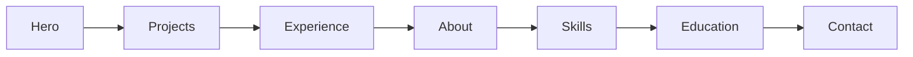

# Portfolio: Design-Review und Cleanup-Plan

## Kurzfazit

Die Seite ([index.html](index.html) / [en.html](en.html) + [styles.css](styles.css)) wirkt bereits **professionell und konsistent** (dunkles Tech-Theme, klare Sektionen, Timeline, Tags). Für ein Portfolio würde ich **nicht** alles neu bauen — sondern gezielt cleaner und projektorientierter machen.

**Was gut ist:** einheitliche Cards, Cyan–Blau-Akzente, sticky Header, sinnvolle Informationshierarchie, DE/EN.

**Was ich anpassen würde:** Projekte sind zu schwach (Kern eines Portfolios), Navigation auf Mobile unruhig, etwas Text-/CTA-Redundanz, fehlende Meta-/A11y-Basics, kleine Bugs.

---

## Empfohlene Richtung (Moderat)

Bleibt bei **statischem HTML/CSS** (passt zu GitHub Pages / `denizcangueney.de`). Kein React/Next nötig für diesen Scope.

Projekte früher zeigen (nach Hero oder direkt danach), damit Recruiter/Besucher zuerst sehen, was du gebaut hast.

---

## 1. Projekte-Section aufwerten (Priorität hoch)

Aktuell: Text-Cards, nur „Fix It Together“ verlinkt, Intro klingt unfertig.

**Zielstruktur pro Projekt-Card:**
- Titel + kurze Beschreibung (1–2 Sätze)
- Tech-Tags (bestehendes `.tag-list` wiederverwenden)
- Link-Zeile: GitHub und/oder Live-Demo (`.project-link` / Buttons)
- Optional später: Screenshot/Thumbnail

**Konkrete Änderungen:**
- Intro umformulieren (selbstbewusst, ohne „perspektivisch dokumentieren“)
- „Fix It Together“: GitHub-URL prüfen (`Fix-It-Togehter` wirkt wie Tippfehler)
- Andere Projekte: echte Links wenn vorhanden; sonst klar als „Konzept / Uni-Projekt“ kennzeichnen — ohne Fake-Links
- Card-Layout in CSS: `display: flex; flex-direction: column;` + Links unten andocken, damit das Grid optisch sauberer wirkt
- Hover auf Projekt-Cards leicht verstärken (Border/Shadow), ohne Überladen

**Offen (von dir beim Umsetzen):** Welche URLs für welche Projekte? Weitere Repos hinzufügen?

---

## 2. Informationsarchitektur cleaner machen

| Bereich | Problem | Anpassung |
|---------|---------|-----------|
| Hero-CTAs | 3 Buttons (CV, About, Kontakt) | Auf 2 reduzieren: z.B. **CV** + **Projekte** (oder Kontakt) |
| About | Lange Absätze + Profil-Card | Texte etwas straffen; Profil-Card behalten |
| Experience | Viele Bullet Points | Top-Rollen ausführlich, ältere (Tecis/Via) auf 1–2 Zeilen kürzen |
| Education | 4 gleichwertige Cards | Aktuelles Studium + relevanteste Stationen betonen; Abitur ggf. kompakter |
| Skills | Sprachen doppelt (About + Skills) | Sprachen nur an einer Stelle (About oder Skills) |
| Contact | Drei ähnliche Absätze | Ein klarer CTA + Mailto-Button |

**Sektionsreihenfolge (Vorschlag):** Hero → Projekte → Erfahrung → Über mich → Skills → Bildung → Kontakt.

---

## 3. Visuelle Konsistenz und „Clean“-Details

In [styles.css](styles.css):

- **CSS-Variablen** für Farben/Abstände (`--bg`, `--accent`, `--muted`, `--radius`, `--section-pad`) — weniger Magic Numbers, leichteres Feintuning
- **Fokus-Styles** (`:focus-visible`) für Tastatur-Navigation
- **Sektions-Trennung** dezent (leichte Border oder abwechselndes Background-Tint), damit Scrollen weniger „eine Wand Text“ wirkt
- **Typo:** System-Font ist okay; optional eine Google-Font (z.B. Inter) — nur wenn du mehr Charakter willst
- **Nav auf Mobile:** horizontales Scrollen der Nav oder kompaktes Menu (Hamburger mit wenig JS), statt Wrapping über viele Zeilen
- Logo als Link nach `#` / Seitenanfang

---

## 4. Kleine Bugs und Polish

- HTML-Struktur in der Projekte-Section prüfen (schließende Tags um Zeile 249 in [index.html](index.html))
- Favicon + Open-Graph/Meta-Description (bessere Tab-/Link-Vorschau)
- Logo klickbar; LinkedIn-Klassen DE/EN angleichen
- Skip-Link für Accessibility
- Beide Sprachdateien ([index.html](index.html) + [en.html](en.html)) parallel aktualisieren

---

## Was ich bewusst nicht vorschlage

- Kein Framework-Rewrite
- Kein Light-Mode (optional später)
- Keine Kontaktformular-Backend (Mailto reicht)
- Keine großen Illustrationen ohne echte Projekt-Screenshots

---

## Umsetzungsreihenfolge

1. Projekte-Cards + Links + Intro + CSS-Feinschliff
2. Reihenfolge + Hero-CTAs + Text kürzen (Redundanzen)
3. Mobile-Nav + A11y/Focus + Meta/Favicon
4. DE/EN sync + kleine Bugfixes

---

## Annahme für diesen Plan

**Moderater Scope** + Fokus auf verlinkbare Projekte. Wenn du nur Fix It Together verlinken kannst, bleiben die anderen zwei als Konzept/Uni klar gekennzeichnet. Beim Bestätigen gerne nachliefern: GitHub-/Demo-URLs und ob die Sektionsreihenfolge „Projekte nach Hero“ so gewünscht ist.
